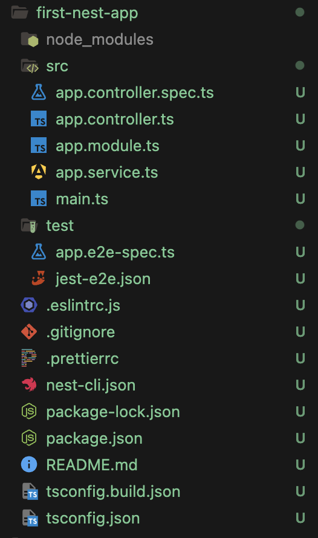

# Step 01 - Introduction to NestJS

### 1. What is NestJS?
   Nest is a framework. for building efficient, scalable, Node.js server-side applications with
   fully supports TypeScript. Under the hood Express (the default) and nodejs is used and optionally
   can be configured to use Fastify as well! his gives developers the freedom to use the myriad of third-party modules which are available for the underlying platform.

### 2. Why we are not going to use Node.js and Express directly? 
   We're not using Node.js or Express directly because with the introduction of Nest.js,
   there's now a standardized structure and pattern for writing code. Many developers and companies have their own unique ways of working and writing code,
   which can make it difficult for teammates to understand. Nest.js, with its modular and organized approach,
   makes it easier to maintain scalability and maintainability in the codebase.

### 3. NestJS Features
   

- **_Routing:_** NestJS provides a powerful routing mechanism out of the box, allowing developers to define paths and controllers to handle HTTP requests. This feature is essential for structuring APIs and web applications.

- **_Testing:_** NestJS has built-in support for testing, enabling developers to write unit tests and end-to-end tests for their applications. This includes easy integration with testing libraries like Jest, helping ensure the quality and reliability of the application.

- **_Middleware:_** Middleware functions in NestJS are used to process requests before they reach the route handler. Middleware can be used for tasks such as logging, authentication, and validation. NestJS provides a robust way to manage middleware, making it flexible for handling cross-cutting concerns.

- **_Documentation:_** NestJS supports the generation of API documentation, especially with tools like Swagger. This feature allows developers to create interactive API documentation, making it easier for others to understand and interact with the API endpoints.

- **_Exception Handling:_** NestJS includes built-in exception handling, allowing developers to manage errors gracefully. By default, it provides a consistent error response format and options to customize error handling logic, making it easier to handle various types of errors in the application.

- **_Plugins:_** NestJS supports various plugins to extend its functionality. These plugins can provide additional features or integrate with other tools, frameworks, or libraries, allowing developers to customize the framework to meet specific requirements.

### 4. Tied down to the Standard?

   

- Here’s an explanation of each item shown in the diagram:

- **_Express:_** is a minimal and flexible Node.js web application framework that provides a robust set of features for web and mobile applications. NestJS is built on top of Express by default, though it can be switched to use Fastify as well if needed. This shows that while NestJS is a powerful framework, developers can opt to use plain Express if they need a more lightweight setup and this company standard to use express.


- **_Class Validator:_** This is a library used with NestJS for validating objects based on decorators, often used with data transfer objects (DTOs) to ensure incoming data meets certain criteria. It integrates smoothly with NestJS but is also usable outside of it for validation purposes.
  

- **_Jest:_** Jest is a testing framework maintained by Facebook, widely used for unit testing in JavaScript projects. NestJS integrates with Jest for testing out of the box, making it a popular choice for writing tests in NestJS applications. However, developers can choose to use Jest without NestJS as well.
  

- **_TypeORM:_** TypeORM is an ORM (Object Relational Mapper) that works well with TypeScript and is a popular choice for database management in NestJS. However, it’s not exclusive to NestJS and can be used in any TypeScript project that requires database operations.
  

- **_Compodoc:_** Compodoc is a documentation tool tailored for Angular and NestJS projects, helping developers generate detailed documentation. While it’s optimized for NestJS, it can also be used for generating documentation in other JavaScript/TypeScript projects.
  

- **_Mongoose:_** Mongoose is a MongoDB object modeling tool designed to work in an asynchronous environment. NestJS provides support for Mongoose as an option for developers who prefer using MongoDB, but it can be used independently of NestJS in any Node.js application.


### 5. Varieties of Applications
   

- **_REST APIs:_** REST (Representational State Transfer) APIs follow a standard architectural style that allows clients and servers to communicate through HTTP. REST is widely used for building web services and is often paired with frameworks like NestJS for structuring endpoints and managing HTTP requests.
  

- **_GraphQL:_** GraphQL is a query language for APIs that allows clients to request only the data they need. Unlike REST, which has fixed endpoints, GraphQL provides a single endpoint and more flexible data fetching. NestJS has support for GraphQL, making it easy to build GraphQL APIs.
  

- **_Microservices:_** Microservices architecture involves building a system as a collection of small, loosely coupled services, each responsible for specific functionalities. NestJS supports a microservices framework, enabling developers to create distributed systems that scale efficiently.
  

- **_MVC:_** MVC (Model-View-Controller) is an architectural pattern that separates application logic into three interconnected components. NestJS supports MVC development, helping structure applications that handle both data (Model) and user interactions (View and Controller).
  

- **_WebSockets:_** WebSockets enable real-time, bi-directional communication between a client and a server. This is useful for applications like chat apps or live notifications. NestJS has built-in support for WebSockets, allowing developers to create real-time features seamlessly.
  

- **_CLI Applications:_** CLI applications are text-based interfaces that allow users to interact with a program through commands. NestJS can be used to build CLI tools or command-line scripts for performing specific tasks.
  

### 6. Setting Up The Development Environment

- **_Download Node.js (LTS Version)_** 
  1. Go to Node.js official website and download the LTS version.
  2. Follow the installation instructions.
  3. Check Node and npm Versions

Open your terminal and verify the installation by checking the versions:


```bash
node -v
```

```bash
npm -v
```

- **_Download Visual Studio Code_** 

  1. [Click here](https://code.visualstudio.com/) to download the latest version of Visual Studio Code.
  2. Follow the installation instructions.
  3. Install Extensions - [Click here](https://marketplace.visualstudio.com/)
     

- **_Extensions_**

  - Spell Checker
  - Prettier - Code formatter
  - ESLint

### 7. Installing NestJS CLI 

“NestJS CLI is the handy tool that you would require in order to develop with NestJS. When working with NestJS, I would recommend installing NestJS CLI globally. And in order to do so, you would use NPM. To use NPM to install in NestJS, navigate to your terminal. Again, I'm using ITERM as my terminal. You can use whatever terminal comes along with your operating system. Just navigate to the terminal and type in this command. You will use NPM, followed by install. And we want to install this package globally, so I will use a delete flag, followed by NestJS CLI.”

The NestJS CLI helps you create and manage NestJS applications easily. Run the following command in your terminal to install it globally

```bash
npm install -g @nestjs/cli
```

Check Version

```bash
nest -v
```

**_check all commands of nestjs_**

```bash
nest --help
```


After running the NestJS help command, you'll see a list of all available commands in a table format. Each command can be used individually, and you can get more details on any specific command by using the following syntax:

```bash
nest generate --help
```

This will show you additional options and usage information for the generate command specifically. You can do this with other commands as well to get detailed help on each one.

for full documentation of nestjs visit [NestJS CLI : click here](https://docs.nestjs.com/cli/overview)


### 8. Creating Our First NestJS Application

- **_Creating Project_** 
  1. Open your terminal and navigate to the desired location.
  2. Run the following command to create a new NestJS project:

```bash
nest new project-name
```


3. After the project is created, you can navigate into the project's directory and let's start to understand the structure of the project.



#### NestJS Project File Structure

This is a brief overview of the files generated in a new NestJS project, explaining the purpose of each.

#### Root Files

- **.eslintrc.js**  
  Configures ESLint, a tool used to identify and fix problematic patterns in code, helping maintain consistent code quality and style.

- **.prettierrc**  
  Configures Prettier, a code formatter that enforces a consistent code style by automatically formatting code based on the defined rules.

- **README.md**  
  A markdown file for project documentation. This file usually includes a description of the project, setup instructions, and usage information.

- **nest-cli.json**  
  Configuration file for the Nest CLI, which allows customization of how the CLI interacts with the project, such as setting entry points and collection paths.

- **package.json**  
  Lists project dependencies, scripts, and metadata about the project. This file is essential for managing the project’s packages and for executing commands like `npm run start` or `npm run test`.

- **tsconfig.build.json**  
  TypeScript configuration specifically for building the project. This file may have different options than the main `tsconfig.json` to optimize the build process.

- **tsconfig.json**  
  The main TypeScript configuration file that defines how TypeScript compiles the project files. This includes options like module resolution and strictness settings.

#### Source Code (src) Files

- **src/app.controller.ts**  
  The main controller file that handles incoming requests and defines the routes. Controllers are responsible for processing incoming requests, delegating tasks, and sending responses.

- **src/app.module.ts**  
  The root application module, organizing the structure of the app by importing modules, controllers, and services. It acts as the starting point of the application’s dependency injection system.

- **src/app.service.ts**  
  Provides core business logic and services used in the app. Services are responsible for handling complex tasks and data processing, often called by controllers.

- **src/main.ts**  
  The entry point of the NestJS application, where the app is bootstrapped. It initializes the app by creating an instance of the root module (`AppModule`) and starts listening for incoming requests.

#### Testing Files

- **test/app.controller.spec.ts**  
  A unit test file for the `AppController`. This test suite checks if the controller behaves as expected in isolation.

- **jest-e2e.json**  
  Configuration file for end-to-end (e2e) testing with Jest, a JavaScript testing framework. It defines settings specifically for running e2e tests, which simulate user interactions to test the app as a whole.

- **test/app.e2e-spec.ts**  
  An end-to-end test file for the application, testing routes and responses to ensure the system behaves correctly from the perspective of an end user.

### 9 Boilerplate Code in NestJS

Here, I’d like to take a bit of your time to explain what is meant by boilerplate code in NestJS. Recently, a significant change has been introduced where NestJS provides us with some boilerplate code snippets. By using these snippets, our backend development becomes faster and works smoothly. Additionally, this code is reliable and scalable. I’m not explaining how to use this code here, but over time, as you gain experience in coding, you’ll use it topic-wise, which will build an understanding of how much flexibility NestJS provides.

For a quick overview, we get snippets of code for modules, controllers, and services. Just run nestjs/cli, will explain later. Now let’s move on to our next topic.

### 10. Best Learning Path For The Course


 "Incremental Course" outlines a structured progression through various technical topics. Starting from foundational concepts like Introduction, Dependency Injection, and Environments, the course advances through Modules, Code Documentation, and Exception Handling. Finally, it covers more specialized areas like Validation Pipes, Working with Databases, and TypeORM. Each topic is connected sequentially, indicating a step-by-step approach to mastering these skills. The color scheme features vibrant purples, suggesting a modern, tech-focused learning path.
