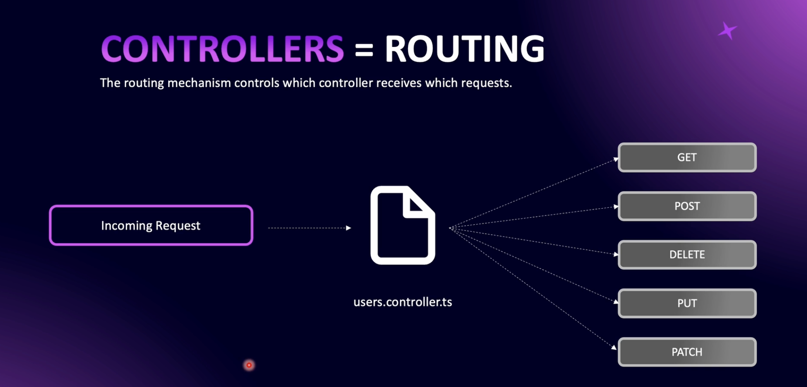

# Step 02 - Understanding Modules

## 1. What are Modules?
<p>
This section outlines the fundamental concepts of using modules in NestJS, focusing on organizing and structuring applications efficiently.
</p>

#### 1. Modules as Packages of Functionality


- In NestJS, **modules** are **_containers for specific functionalities_** within the application.
- When a new functionality is introduced, it should be encapsulated within a dedicated module.
- For instance, in a blog application, a **"Users"** module might handle everything related to user functionality, from routes to data handling.

#### 2. Primary File Structure in a Module

- Each module includes a **_primary file_** which typically follows the naming pattern **_moduleName.module.ts_** (e.g., **_users.module.ts_** for a Users module).
- This primary file acts as the **entry point** for the module, coordinating other essential files within the module.

#### 3. Controller Files

- **Controllers** are essential components in a module and are generally named **_moduleName.controller.ts_** (e.g., **_users.controller.ts_**).
- They manage routing and handle incoming HTTP requests, delegating them to relevant services within the module.
- For example, requests associated with user actions, such as registration or login, would be routed through the **_users.controller.ts_** file.

#### 4. Service Files

- Modules often include **service files** (e.g., **_users.service.ts_**) that house the **business logic** for the module.
- Services provide reusable functions, allowing the controller to execute necessary operations.
- The **_users.service.ts_** file, for instance, might contain methods for user authentication, retrieving user profiles, and other user-related actions.

#### 5. Entity and Test Files

- **Entity files** (e.g., **_users.entity.ts_**) represent database models and are typically found in modules that interact with a database.
- Modules may also contain **spec files** (e.g., **_users.controller.spec.ts_**) for testing the controller and verifying routes and responses.

#### 6. Default App Module

- A default **AppModule** (**_app.module.ts_**) is created with each NestJS installation, serving as the **core module** of the application, linking to other modules.
- The **_main.ts_** file acts as the starting point of a NestJS application. When the application is launched, **_main.ts_** references the **AppModule**, which then connects to all other declared modules.


### Structure of a Basic Module in NestJS

A typical module in NestJS includes the following files:
- **Primary Module File** (e.g., **_users.module.ts_**): Entry point of the module.
- **Controller** (e.g., **_users.controller.ts_**): Manages routes and HTTP requests.
- **Service** (e.g., **_users.service.ts_**): Contains business logic.
- **Entity** (e.g., **_users.entity.ts_**): Represents database models.
- **Spec File** (e.g., **_users.controller.spec.ts_**): For testing the controller.


### Reflection

The modular approach in NestJS promotes a clean structure, making it easier to develop and manage applications by grouping related files into dedicated modules. This structure improves readability and enhances reusability, as each module operates independently while integrating smoothly with others.

---

## 2. How NestJS Bootstraps (main.ts)

In a NestJS application, main.ts is the entry point. The bootstrap function is responsible for setting up the application. By using NestFactory.create(AppModule), it initializes the application with AppModule as the base, ensuring that all routes, dependencies, and configurations are correctly loaded.

```typescript

import { NestFactory } from '@nestjs/core';
import { AppModule } from './app.module';

async function bootstrap() {
  const app = await NestFactory.create(AppModule);
  await app.listen(3000);
}

bootstrap();

```

### Setting the Port with app.listen()

The app.listen() method launches the server and listens on the specified port. By default, this guide uses port 3000, but it can be easily changed to another port, such as 3300.

```typescript
await app.listen(3300);

```

After updating and saving this line, restart the server to apply the new port configuration. Your application will then be accessible at http://localhost:3300.

### Debugging with the app Object

For deeper insights into the application’s structure and configuration, log the app object to the console. This reveals the various components of your NestJS app, aiding in debugging and customization.

```typescript
console.log(app);

```

### Summary

1. NestFactory initializes the application.
2. AppModule organizes the main structure of the application.
3. app.listen(port) starts the server on the specified port.

With these configurations in main.ts, your NestJS application is ready for further development, customization, and expansion!

---

## 3. Understanding the App Module


### 1. Structure of the `src` Directory
The `src` folder typically includes key files like `app.module.ts`, which serves as the root module for the entire application. This file is responsible for importing and organizing other modules, controllers, and services.


### 2. Main.ts - Application Entry Point
The `main.ts` file uses the `bootstrap()` function to initialize and load the application’s main module, `app.module.ts`. This makes it the central point where the application starts running.

### 3. App Module Naming Convention
The `app.module.ts` file contains the word "module" by convention, making it easy for developers to recognize it as a module file. However, it’s not mandatory to name it this way. What makes a file a module is the use of the `@Module()` decorator within it, as shown in the example code below:

```typescript
import { Module } from '@nestjs/common';
import { AppController } from './app.controller';
import { AppService } from './app.service';

@Module({
  imports: [],
  controllers: [AppController],
  providers: [AppService],
})
export class AppModule {}
```


### 4. Importing New Modules
- As you add new modules to your NestJS application, they should be added to the imports array in app.module.ts. This makes them accessible within the application's module tree, centralizing the application configuration.


### 5. Organizing Files within `src`
- In the src folder, files like controllers and services can be stored directly or organized into separate directories. If you decide to reorganize them into folders, ensure that the import paths in main.ts and other files are updated to prevent errors

### 6. Naming Conventions for Controllers and Services
- The filenames for controllers and services don’t need to explicitly contain the words "controller" or "service." Their functionality is determined by the use of @Controller() and @Injectable() decorators rather than by the filename.

### Additional Resources
For further exploration, refer to the NestJS [Resource Repository](https://github.com/NadirBakhsh/nestjs-resources-code/commit/eff8d909fd64d22be4758a28c8adfcefb98e4b08), where you can review sample code and learn best practices for NestJS development.

---

## 4. Creating a New Users Module


1. Start by creating a new folder inside the `src` directory named `users`.
2. Inside the `users` folder, create a new file named `users.module.ts`. This file will serve as the main module file for the `Users` module.

Here is the initial code for `users.module.ts`:

```users.module.ts

export class UsersModule{}

```

This code simply initializes a class named UsersModule. However, to make it behave like a NestJS module, we need to import and use the @Module decorator from @nestjs/common.

### Step 2: Adding the @Module Decorator

Modify the users.module.ts file as follows:

```users.module.ts

import { Module } from '@nestjs/common';

@Module({})
export class UsersModule {}

```

The @Module decorator allows us to define a NestJS module. It accepts an object as an argument, where we can specify the following properties:

- imports: Modules that this module depends on.
- controllers: Controllers associated with this module.
- providers: Services/providers used by this module.

At this stage, we have created a basic UsersModule.


### Step 3: Adding the UsersModule to AppModule

To make the UsersModule available across the application, we need to import and register it in the app.module.ts file.

- Open the app.module.ts file.
- Import the UsersModule.
- Add it to the imports array of the @Module decorator.

```app.module.ts

import { Module } from '@nestjs/common';
import { AppController } from './app.controller';
import { AppService } from './app.service';

// Import the UsersModule
import { UsersModule } from './users/users.module';

@Module({
  imports: [UsersModule], // Add the UsersModule here
  controllers: [AppController],
  providers: [AppService],
})
export class AppModule {}

```

### Step 4: Verifying the UsersModule

To ensure the `UsersModule` is correctly initialized and working, you can check the terminal logs. If your application is running in development mode, you should see a log message indicating that the `UsersModule` has been `initialized` as part of the application’s dependencies.

```bash
[Nest] 12345   - UsersModule dependencies initialized
```


## Summary

This guide explains how to create a `UsersModule` in a NestJS application, integrate it into the `AppModule`, and verify its functionality. Follow these steps:

1. **Create Module**: Add a `users` folder in the `src` directory and create a `users.module.ts` file.
2. **Initialize Module**: Use the `@Module` decorator from `@nestjs/common` to define the `UsersModule`.
3. **Register Module**: Import the `UsersModule` into the `app.module.ts` and include it in the `imports` array.
4. **Verify Module**: Check the terminal logs to ensure the `UsersModule` is initialized correctly.

## Source Code

View the full source code [Resource Code Repository](https://github.com/NadirBakhsh/nestjs-resources-code/commit/206e9331aac14d950634b671c042a3a0ee726498)


## 3. Creating a New Users Module Using Nest CLI - Part 2
In this guide, we'll focus on creating a UsersModule using the Nest CLI, streamlining our workflow by replacing manual processes with CLI-generated code. Let's break it down step-by-step.

### Removing the Manually Created Module
Before proceeding, ensure that any manually created UserModule and its corresponding imports in `app.module.ts` are removed. This will help avoid conflicts when using the Nest CLI to generate the module.

### What is Nest CLI?
If you’re new or need a quick recap, Nest CLI is a command-line interface provided by NestJS that allows developers to:

- Automate repetitive tasks like creating files, boilerplate code, or scaffolding modules, services, controllers, etc.
- Save time by running predefined commands to generate consistent and correctly structured code.
- Customize project generation behavior for specific needs.

With Nest CLI, you can avoid manual creation and configuration of files, making your development faster and more efficient.

### Generating a Module with the CLI

To generate a UsersModule, follow these steps:

Step 1: Preview the Output with --dry-run
Run the following command in your terminal:

```bash
nest g module users --dry-run
```
Explanation:
- The nest g module users command tells Nest CLI to generate a module named users.
- The --dry-run flag ensures that the CLI doesn’t create files immediately. Instead, it outputs the files and code it 

would generate, letting you preview the changes without committing them.
This is a safe way to ensure that the command does what you expect before making any actual changes.

Step 2: Create the Module Without --dry-run
Once you're satisfied with the preview, run the command without the --dry-run flag:

```bash
nest g module users
```

- This creates a users directory inside the src folder and generates the users.module.ts file.

### Handling File Locations
If you’ve previously moved files like app.module.ts into a custom directory (e.g., app), you might encounter issues because Nest CLI defaults to the src directory for imports and updates.

To ensure everything works seamlessly:

1. Move Back to src Directory:

- Ensure that all default NestJS files like app.module.ts are in the src root directory.
- The CLI relies on this structure for automatic updates during module creation.

2. Customize Nest CLI Behavior (Optional):

- If you want Nest CLI to recognize a custom directory (e.g., app), modify the nest-cli.json file.
- Update the sourceRoot property to point to your custom directory

With this configuration, CLI commands will generate and update files in the app directory instead of src.

### Visual Overview
Below is an example of the CLI output when generating a UsersModule:


### Summary
Using the Nest CLI simplifies module creation and project management. Here's a quick recap:

1. Remove manual files: Clean up any previously created modules and imports.
2. Preview with --dry-run: Test the CLI command before applying changes.
3. Generate modules: Run the command without --dry-run to create files.
4. Handle custom directories:
- Ensure files are in src by default, or
- Modify nest-cli.json to match your directory structure.
With these steps, you’ll efficiently create and manage modules in your NestJS project.

### Source Code

View the full source code [Resource Code Repository](https://github.com/NadirBakhsh/nestjs-resources-code/commit/16bb8436c839b278fb6bd66cb8eecdda0c9d60cf)

---

## 4. What is a REST API


#### 1. Definition
 A REST API (Representational State Transfer API) is a type of Application Programming Interface (API). APIs allow different software applications to communicate with each other. A REST API follows specific design principles known as the REST architectural style.

Key principles of REST APIs include:
- Stateless communication: Each request from a client to a server must contain all the necessary information, and the server does not store any session state between requests.
- Resource-based: REST uses unique URLs to identify resources (e.g., a user, file, or database entry).
- HTTP Methods: It typically uses standard HTTP methods (like GET, POST, PUT, DELETE) to perform operations on resources.
- Representation: Resources are represented in standard formats such as JSON or XML.
- Client-Server Separation: The client (frontend) and server (backend) are independent, allowing for flexibility and scalability.


#### 2. Rest Design Principles


### REST Design Principles

1. **Client-Server Decoupling:**
   - The client (frontend) and server (backend) operate independently.
   - The client only needs to know the URI of the resource, and the server handles the logic for providing the resource.
   - This separation enhances flexibility and scalability.


- GET: Retrieve data (e.g., read-only operations).
- POST: Create a new resource.
- DELETE: Remove a resource.
- PUT: Replace an entire resource.
- PATCH: Update part of a resource.


2. **Statelessness:**
   - Each request from the client to the server must contain all the necessary information.
   - The server does not store the state of the client session.
   - This simplifies server design and allows for greater scalability.


3. **Cacheability:**
   - Responses from the server should explicitly state whether they are cacheable or not.
   - Proper use of caching improves performance by reducing the need for repetitive client-server interactions.

   

4. **Uniform Interface:**
   - Ensures consistent and standardized interaction between the client and server.
   - This is achieved through the use of standard HTTP methods (e.g., GET, POST, PUT, DELETE) and resource representations.
 


5. **Layered System:**
   - The API architecture can use intermediary layers (like load balancers, proxies, etc.) to manage system complexity.
   - These layers are invisible to the client and help with scalability, security, and performance.


6. **Anatomy of an API Endpoint**

### 1. **HTTP Verb: GET**
- Specifies the HTTP method used for the request.
- "GET" retrieves data from the server without modifying anything.

### 2. **Domain: `https://apiurl.com`**
- The base URL of the API, representing the server or service being accessed.
- It's where the API is hosted.

### 3. **Route: `/posts/`**
- Defines the specific resource or collection being accessed.
- Represents the endpoint for posts in this case.


### 4. **Params: `/author/`**
- Path parameters provide additional context or specify the targeted entity.
- For example, it identifies a specific author.

### 5. **Query: `?limit=10&offset=20`**
- Key-value pairs that filter or customize the response.
- Used here for pagination with `limit` (items per page) and `offset` (starting point).


### 6. **Body: `{"author": "John"}`**
- Data sent in the request body, often in POST or PUT requests.
- In this case, it specifies an author named "John".


7. **Code on Demand (Optional):**
   - Servers can provide executable code (e.g., JavaScript) to clients for enhancing their functionality.
   - This is an optional feature in RESTful APIs and is used less frequently.

These principles collectively ensure that RESTful APIs are scalable, maintainable, and efficient while maintaining simplicity and ease of use.

---


## 5. Setting Up Postman and httpYac

### Steps to Install and Use Postman and HTTP Yac for Sending Requests to a Server

#### **Postman Installation and Usage**
1. **Download Postman**:
   - Visit [postman.com/downloads](https://www.postman.com/downloads).
   - Select the appropriate version for your OS (e.g., Windows, Mac).
   - Download and save the installer.

2. **Install Postman**:
   - **Mac**: Move the unzipped installer to the Applications folder.
   - **Windows**: Run the installer to complete installation.

3. **Run Postman**:
   - Open Postman.
   - Choose the lightweight API client option if you don’t want to sign up.

4. **Send a Request with Postman**:
   - Start your NestJS application:
     ```bash
     npm run start:dev
     ```
   - Open Postman and set up a **GET request** to `http://localhost:3000`.
   - Send the request and view the response ("Hello from NestJS").

5. **Explore Postman Features**:
   - Use the dropdown to select HTTP verbs (GET, POST, PUT, DELETE, etc.).
   - Add query parameters, headers, authorization, and request body using the UI.

---

#### **HTTP Yac Installation and Usage**
1. **Install HTTP Yac in VS Code**:
   - Open VS Code.
   - Navigate to the Extensions view (`View > Extensions` or shortcut).
   - Search for `httpyac`.
   - Click **Install** and restart VS Code if needed.

2. **Set Up HTTP Yac**:
   - Create a file for requests with a `.http` extension (e.g., `app.endpoints.http`).
   - Add your HTTP requests within this file.

3. **Write a GET Request in the `.http` File**:
   - Use a comment to describe the request:
     ```http
     # Get request for app controller
     ```
   - Add the HTTP verb and URL:
     ```http
     GET http://localhost:3000
     ```
   - Save the file.

4. **Send a Request with HTTP Yac**:
   - Click the **Play** button (▶) next to the request in the `.http` file.
   - View the response (e.g., "Hello from NestJS").

5. **Advantages of HTTP Yac**:
   - Requests are saved as code, allowing them to be committed to a Git repository.
   - Easily shareable among developers within the codebase.

---

#### **Comparison of Postman and HTTP Yac**
- **Postman**:
  - GUI-based tool for easy request creation.
  - Useful for beginners or those already accustomed to Postman.
  - Shareable via collections.

- **HTTP Yac**:
  - Code-based request handling directly within VS Code.
  - Requests become part of the source code and Git-managed.
  - Recommended for developers who prefer integration with code editors.

--- 

## 6. Creating Controllers



#### A. Creating a Controller Manually

**Step 1: Set Up the Users Directory**
Navigate to the users directory within your project, where the users module is located. Ensure your users.module.ts file is properly created and imported into the app module.

**Step 2: Create the Controller File**
Create a new file named users.controller.ts inside the users directory. While the file name isn't mandatory for functionality, it’s a good practice to follow NestJS naming conventions.

```
users

├── users.module.ts
├── users.controller.ts

```

**Step 3: Define the Controller Class**
1. Export a Class: Define a class and export it.
2. Decorate the Class: Use the @Controller() decorator from @nestjs/common to mark the class as a controller.

```
import { Controller } from '@nestjs/common';

@Controller('users')
export class UsersController {}

```

- The @Controller('users') decorator tells NestJS that this controller handles requests to the /users endpoint.

**Step 4: Link the Controller to the Module**
Add the `UsersController` to the `controllers` array in` users.module.ts`:

```
import { Module } from '@nestjs/common';
import { UsersController } from './users.controller';

@Module({
  controllers: [UsersController],
})
export class UsersModule {}

```

This step ensures that the users module recognizes and uses the `UsersController`.

#### B. Creating a Controller Using NestJS CLI

The CLI simplifies the creation process by automating the linking of controllers to modules.

**Step 2: Use the --dry-run Flag**
The --dry-run flag lets you preview the changes without applying them. Run the command:

```
nest generate controller users --dry-run
```

Output:
- A users.controller.ts file is created.
- The users.module.ts is updated automatically.
- A .spec.ts test file is also created by default.


**Step 3: Disable Test File Generation**
If you don’t need test files, use the --no-spec flag:

```
nest generate controller users --no-spec
```

This will create only the controller file and update the module.

**Generated Controller Structure**
The CLI-generated users.controller.ts file looks like this:

```
import { Controller } from '@nestjs/common';

@Controller('users')
export class UsersController {}
```

Additionally, the users.module.ts file is updated:

```
import { Module } from '@nestjs/common';
import { UsersController } from './users.controller';

@Module({
  controllers: [UsersController],
})
export class UsersModule {}

```

**Conclusion**
Now you know:
- What a controller is and why it's essential in NestJS.
- How to create a controller manually by defining a class and linking it to a module.
- How to leverage the NestJS CLI to streamline the creation process.

Ans: In the next step, we’ll explore how to define methods within the controller to handle different HTTP requests (GET, POST, DELETE, etc.). Stay tuned!

Code example from the [Resource Code Repository](https://github.com/NadirBakhsh/nestjs-resources-code/commit/2ff1504b797e37bb136c83d5a25bf64418b021c6)

---


## 7. Working With Routing Decorators

#### Step 1: Create an HTTP Directory

- Inside the users directory, create a folder called HTTP.
- This folder will contain HTTP request files.
- For example, create a file named users.get.endpoints.http. This file will handle all GET requests related to users.

#### Step 2: Write a GET Request

In the `users.get.endpoints.http` file:

```http
GET http://localhost:3000/users
```

This sends a simple GET request to the /users endpoint.

#### Step 3: Create a Method in the Controller

In `users.controller.ts`:
1. Create a public method called getUsers.
2. Add a message that returns when the method is called.

```typescript
public getUsers() {
  return "You sent a GET request to the users endpoint.";
}
```

#### Step 4: Use a Decorator to Bind the GET Request
- Import the `@Get` decorator from @nestjs/common.
- Use the `@Get` decorator above the getUsers method.

```
import { Get } from '@nestjs/common';

@Get()
public getUsers() {
  return "You sent a GET request to the users endpoint.";
}

```

This ensures that all `GET` requests to /users are routed to this method.

#### Step 5: Create a POST Request
- Create another file: users.post.endpoints.http.
- Add a POST request to the /users endpoint with a JSON body.

```http
POST http://localhost:3000/users
Content-Type: application/json

{}
```

#### Step 6: Add a Method for POST in the Controller
- Create a new method called createUsers.
- Use the @Post decorator to route POST requests.

```
import { Post } from '@nestjs/common';

@Post()
public createUsers() {
  return "You sent a POST request to the users endpoint.";
}
```

#### Step 7: Add Other HTTP Methods

NestJS provides decorators for other HTTP methods like:

`@Patch()` for PATCH
`@Put()` for PUT
`@Delete()` for DELETE

```typescript
import { Patch, Put, Delete } from '@nestjs/common';

@Patch()
public updateUser() {
  return "You sent a PATCH request to update the user.";
}

@Put()
public replaceUser() {
  return "You sent a PUT request to replace the user.";
}

@Delete()
public deleteUser() {
  return "You sent a DELETE request to delete the user.";
}

```

#### Summary
- Create HTTP files for each method (GET, POST, etc.).
- Add request examples in those files.
- Use appropriate decorators (@Get, @Post, etc.) in the controller to handle each request type.
- Respond with simple messages for testing and build upon them as needed.

code Example from the [Resource Code Repository](https://github.com/NadirBakhsh/nestjs-resources-code/commit/25866075d3e7109d850b677e3fff674aa5b2ef13)

---

## 8. Understanding the Anatomy of a NestJS API Endpoint


NestJS, a powerful framework for building server-side applications, provides extensive features to create robust RESTful APIs.

####  Params, Query, and Body


#### Handling HTTP Verbs and Routes

In NestJS, decorators are used to define the HTTP verbs (e.g., GET, POST) and routes for API endpoints. This allows developers to handle incoming requests and define specific methods for the required actions.

For example, you can use the @Get() decorator for handling GET requests:
```typescript
@Get('users')
getUsers() {
  return 'Fetching users';
}
```

In the example above, the @Get() decorator specifies that the getUsers method is triggered when a GET request is sent to the /users route.

#### Defining Required and Optional Parameters

Parameters can be included in routes using the @Param() decorator. For instance, to fetch a user by their ID:

```typescript
@Get('users/:id')
getUser(@Param('id') id: string) {
  console.log(`User ID: ${id}`);
}
```

- Required Parameters: Defined as :paramName. For example, /users/:id requires an id to be sent.

- Optional Parameters: Appended with a question mark in the TypeScript definition. Optional parameters are not mandatory in the route.

Example of optional parameters:
```typescript
@Get('users/:id?')
getUser(@Param('id') id?: string) {
  console.log(`User ID: ${id || 'No ID provided'}`);
}
```

##### Working with Query Strings

Query strings can be retrieved using the @Query() decorator. Query parameters are part of the URL but not included in the route.

```typescript
@Get('users')
getUsers(@Query() query: any) {
  console.log(`Query Params:`, query);
}
```
For example, sending a GET request to /users?limit=10&offset=20 will print:

```
{ "limit": "10", "offset": "20" }
```

Query strings can also be broken into multiple lines for readability:

```
/users?
limit=10&
offset=20
```

#### Retrieving the Request Body

The @Body() decorator allows you to grab the request body sent in POST or PUT requests.

```typescript
@Post('users')
createUser(@Body() body: any) {
  console.log(`Request Body:`, body);
}
```

Example request body:

```json
{
  "firstName": "John",
  "lastName": "Doe",
  "email": "john.doe@example.com",
  "password": "securepassword"
}
```

This request body is automatically converted into a JavaScript object, making it easy to use within your methods.

#### Accessing the Raw Express Request

NestJS uses Express.js under the hood. While it is generally recommended to use decorators, you can directly access the raw Express request object if needed using the @Req() decorator and the Request interface from Express.

```typescript
import { Req } from '@nestjs/common';
import { Request } from 'express';

@Post('users')
createUser(@Req() req: Request) {
  console.log(`Raw Request:`, req);
}
``` 

However, this approach bypasses some of NestJS’s built-in features like automatic exception handling and is not recommended unless absolutely necessary.


#### Summary

NestJS simplifies the process of working with API endpoints by providing powerful decorators:

@Get(), @Post(), etc., for defining HTTP verbs and routes.

@Param() for handling route parameters.

@Query() for working with query strings.

@Body() for retrieving the request body.

@Req() for accessing the raw Express request object (use sparingly).

These tools provide full control over incoming requests, making NestJS a highly efficient framework for building APIs.

code Example from the [Resource Code Repository](https://github.com/NadirBakhsh/nestjs-resources-code/commit/54e89034cb121a0a5bb288d1632e66a236c9096b)

---

## 9. Additional Request Components


1. Extracting Specific Parameters: You can extract specific parameters from the request URL, query, or body using decorators like @Param(), @Query(), and @Body().

2. Validation: It's generally easier to validate the entire object rather than individual parameters.

3. Additional Decorators: NestJS provides other useful decorators like @Headers() and @Ip() to extract headers and the IP address of the request.

**Example Code**
Here is an example of how you can use these decorators in a NestJS controller:

```typescript
import { Controller, Get, Post, Param, Query, Body, Headers, Ip } from '@nestjs/common';

@Controller('users')
export class UsersController {
  @Get(':id')
  getUser(@Param('id') id: string, @Query('limit') limit: string) {
    console.log('ID:', id);
    console.log('Limit:', limit);
    return `User ID: ${id}, Limit: ${limit}`;
  }

  @Post()
  createUser(@Body('email') email: string, @Headers() headers: any, @Ip() ip: string) {
    console.log('Email:', email);
    console.log('Headers:', headers);
    console.log('IP:', ip);
    return `User created with email: ${email}`;
  }
}
```

code Example from the [ReproResource Code Repository](https://github.com/NadirBakhsh/nestjs-resources-code/commit/3016b02dee22a907e184a904ce237d0bd3e05850)

---

## 10. Providers in NestJS


### Understanding Providers

Think of providers as additional classes in your module that help you add business logic. While controllers handle routing logic, providers handle the business logic. This separation ensures that controllers remain focused on routing.

**Role of Providers**
Controllers: Handle routing logic.
Providers: Handle business logic.

**For example, in a user module:**


- The controller handles HTTP requests.
- The service provider (users.service.ts) handles business logic, such as interacting with the database or other providers.

**Example Use Cases**
- Database Interaction: The service provider connects to the database.
- Third-Party API Interaction: Separate providers handle interactions with third-party APIs, such as checking a blacklist or fetching user details from Gravatar.

**Types of Providers**

- Service: Connects to the database.
- Repository: Manages data persistence.
- Factory: Creates instances of objects.
- Helper: Provides utility functions.

**Benefits of Providers**

- Separation of Concerns: Each provider handles a specific functionality.
- Modularity: Providers make the codebase more modular and maintainable.

