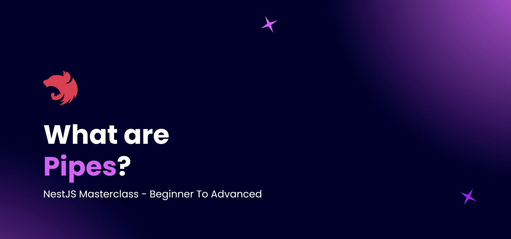
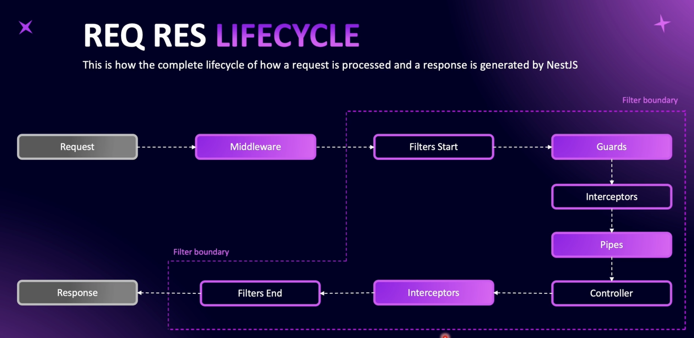
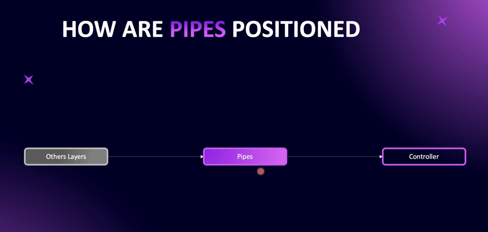
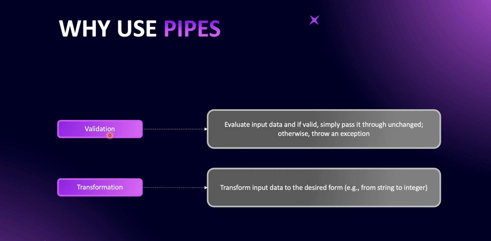
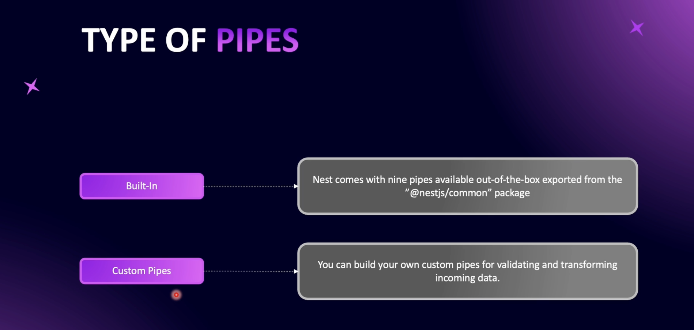
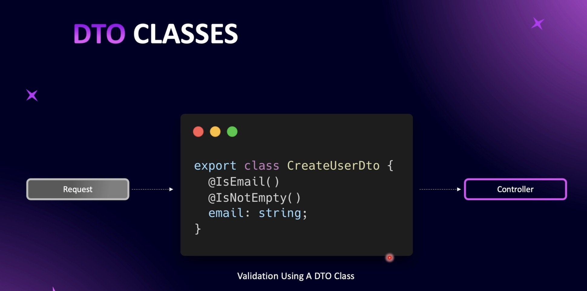
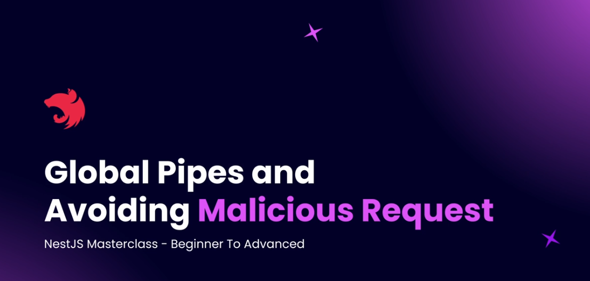
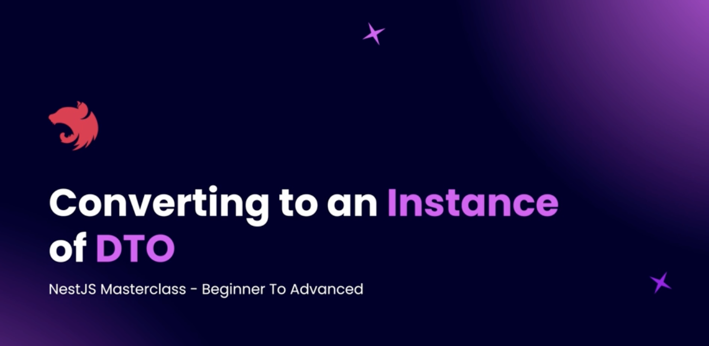
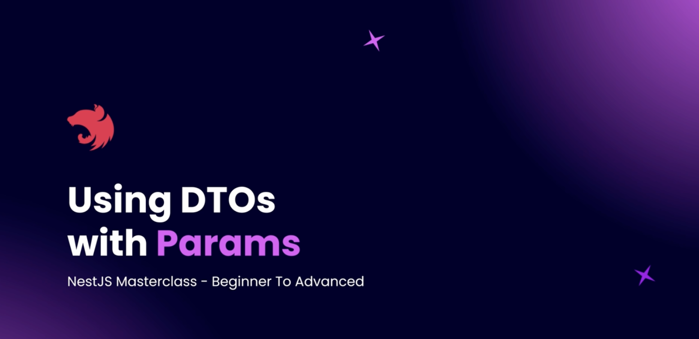

# Step 03 - Validation and Pipes

## 1. What are Pipes?


Pipes are a powerful feature in NestJS used to transform and validate incoming request data before it reaches the controller. They act as a layer in the request-response lifecycle to ensure that data sent to your application is in the correct format and adheres to your expected validation

 **Overview**


NestJS is a progressive Node.js framework for building efficient, reliable, and scalable server-side applications. This project explores the various components involved in the request-response lifecycle:

- Middleware
- Filters
- Guards
- Interceptors
- Pipes
- Controllers
- Providers/Services


### **Pipes**
- **Purpose**: Validate and transform incoming request data.
- **Usage**: 
  - **Validation**: Ensure data matches schema.
  - **Transformation**: Convert data to the required format.



### **Reasons to Use Pipes**

**Centralized Validation Logic**
Pipes allow you to consolidate your validation logic in a reusable way, rather than repeating it in multiple places.
By leveraging tools like class-validator with ValidationPipe, you can declaratively define validation rules in Data Transfer Objects (DTOs).

 
### **Built-in Pipes:**

NestJS provides several built-in pipes for common validation and transformation needs.

Examples:
- ValidationPipe – Validates data using class-validator decorators.
- ParseIntPipe – Transforms a string into an integer.
- ParseBoolPipe – Transforms a string into a boolean ("true" to true).
- ParseArrayPipe – Ensures incoming data is an array.
- ParseUUIDPipe – Validates and parses UUID strings.

### **Custom Pipes:**
- Developers can create custom pipes for specific use cases.
- Useful for advanced validation logic or transformations tailored to the application's requirements.

---

## 2. Validation and Transformation Needs

Final Endpoint - /users/id?limit=10&page=1

Param id - optional, convert to integer, cannot have a default value  
Query limit - integer, default 10  
Query page - integer, default value 1  

==> USE CASES  
/users/ -> return all users with default pagination  
/users/1223 -> returns one user whose id is 1223  
/users?limit=10&page=2 -> return page 2 with limit of pagination 10

code: example where we need to validate and transform the incoming request data
[GitHub Repository](https://github.com/NadirBakhsh/nestjs-resources-code/commit/6b04e6c3d7582c89e95078356877405e0c9efb40#diff-f50bd3ad4287f192c56e363ab00244f9f773705f9e41b8214b1a22804e40659cR28)

---

## 3. Validating Params with Built-in Pipes

### *ParseIntPipe*

```typescript
import { Controller, Get, Param, Query, ParseIntPipe } from '@nestjs/common';

export class UsersController {
  @Get('/:userId?')
  public getUser(
    @Param('userId', ParseIntPipe) userId: number | undefined, 
    @Query() query: any
    ) {
    if (userId) {
      console.log('type of id', userId);
      console.log('userId', userId);
      console.log('limit', typeof query?.limit);
      console.log('offset', typeof query?.offset);
      return `Get user with ID ${userId}`;
    }
    return `Get all users`;
  }
}
```

code example: [Validating Params with Built-in Pipes](https://github.com/NadirBakhsh/nestjs-resources-code/commit/b1a4c8b32b796a74ef866552a26dff97e35949ff)

---

## 4. Validating Query Params

### Validating and Transforming Query Parameters in NestJS

**Overview**

- Use NestJS's query decorators to grab parameters from incoming requests.
- Apply transformation and validation pipes to query parameters.
- Assign default values to parameters when they are not provided by the client.

Start by grabbing `limit` and `page` from the query string using the `@Query()` decorator.

```typescript
@Query('limit', ParseIntPipe) limit: number,
@Query('page', ParseIntPipe) page: number,

```

**Applying Validation**
Use ParseIntPipe to ensure that both limit and page are converted into integers. If a non-convertible value is provided, NestJS will throw a validation error.

 **Setting Default Values**
To make the parameters optional and assign default values:

Import DefaultValuePipe from NestJS.
Assign default values using the new DefaultValuePipe(value) syntax.

```typescript
@Query('limit', new DefaultValuePipe(10), ParseIntPipe) limit: number,
@Query('page', new DefaultValuePipe(1), ParseIntPipe) page: number,

```

**Handling Requests**

Test the endpoint by:
Sending requests with valid limit and page parameters.
Omitting limit and page to observe default values being assigned.
Sending invalid data to see validation errors in action.

 **Additional Pipes**
NestJS offers various other pipes for transformation and validation:

ParseFloatPipe - Validates and converts floating-point numbers.
ParseBoolPipe - Converts true/false or 1/0 into boolean values.
Custom pipes can also be created for specific use cases.
Example Endpoint

```typescript
@Get('users')
findAll(
  @Query('limit', new DefaultValuePipe(10), ParseIntPipe) limit: number,
  @Query('page', new DefaultValuePipe(1), ParseIntPipe) page: number
) {
  console.log({ limit, page });
  return { limit, page };
}
```

github code: [Validating Query Params](https://github.com/NadirBakhsh/nestjs-resources-code/commit/3e263d6a0494484e73707fe306d1a8fd88192a21)

---

## 5. Introduction to DTO

A data transfer object, commonly called a DTO, is an object used to validate data and define data structure sent into your Nest applications. DTOs are similar to interfaces, but differ from interfaces in the following ways:



- Interfaces are used for type-checking and structure definition.
- A DTO is used for type-checking, structure definition, and data validation.
- Interfaces disappear during compilation, as it’s native to TypeScript and doesn't exist in JavaScript.
- DTOs are defined using classes that are supported in native JavaScript. Hence, it remains after compilation.

---

## 6. Creating Our First DTO

step-by-step guide on creating a DTO (Data Transfer Object) in NestJS using the class-validator package

### 1. Setup the Environment:

```bash
npm install class-validator
```

### 2. Create the DTO File:

- In your users module, create a directory named dtos.
- Inside it, create a file named create-user.dto.ts.

### 3. Define the Class:
- Create and export a class named CreateUserDto.
- Define properties for the class (e.g., firstName, lastName, email, password).

### 4. Add Type Annotations:
- Use TypeScript types for each property to specify their data types.
- Use Validation Decorators:

Apply decorators from class-validator to validate the input data.

- Use @IsString() to ensure a property is a string.
- Use @IsNotEmpty() to ensure required properties are not empty.
- Use @IsOptional() for optional properties.
- Use @IsEmail() for validating email addresses.
- Use @MinLength() and @MaxLength() for length constraints.
- Use @Matches() for complex patterns (e.g., password validation).

### 5. Customize Validation Messages:
Add custom error messages using an object with a message property in decorators like @Matches().
Example Implementation:

```typescript
import { IsString, IsNotEmpty, IsOptional, IsEmail, MinLength, MaxLength, Matches } from 'class-validator';

export class CreateUserDto {
  @IsString()
  @IsNotEmpty()
  @MinLength(3)
  @MaxLength(96)
  firstName: string;

  @IsString()
  @IsOptional()
  @MinLength(3)
  @MaxLength(96)
  lastName?: string;

  @IsString()
  @IsEmail()
  @IsNotEmpty()
  email: string;

  @IsString()
  @IsNotEmpty()
  @MinLength(8)
  @Matches(/^(?=.*[A-Za-z])(?=.*\d)(?=.*[@$!%*#?&])[A-Za-z\d@$!%*#?&]{8,}$/, {
    message: 'Password must be at least 8 characters long, contain one letter, one number, and one special character.',
  })
  password: string;
}
```
- alidation Flexibility: Use class-validator for robust validations in NestJS DTOs.
- Custom Error Messages: Improve user experience with detailed validation messages.
- Documentation: Refer to Class Validator GitHub for more complex scenarios and decorators.

Github code: [Creating Our First DTO](https://github.com/NadirBakhsh/nestjs-resources-code/commit/c358af5efce7ac1089b7e983e352ccc3a88257b6)

---

## 7. Connecting DTO to Route Method

- Use the @Body() decorator to extract the request body.
- Assign the DTO class as the type annotation to the @Body() parameter.
- Enable validation by attaching the ValidationPipe.

```typescript

import {
  Controller,
  Post,
  Body,
  Headers,
  Ip,
  ParseIntPipe,
  ValidationPipe,
} from '@nestjs/common';
import { CreateUserDto } from './dtos/create-user.dtos';

@Controller('users')
export class UsersController {
 @Post()
  public createUser(
    @Body(new ValidationPipe()) createUserDto: CreateUserDto,
    @Headers() headers: any,
    @Ip() ip: string,
  ) {
    const userData = createUserDto;
    console.log(userData);
    console.log('Headers:', headers);
    console.log('ip:', ip);
    return `Create user with data: ${JSON.stringify(userData)}`;
  }
}

```
code example: [Connecting DTO to Route Method](https://github.com/NadirBakhsh/nestjs-resources-code/commit/c098f530f59031e698bdd01bcc644b7e1fab6b23)

---


## 8. Global Pipes and Avoiding Malicious Requests


To avoid repetitive code, you can enable the ValidationPipe globally in the main.ts file.

```main.ts
import { NestFactory } from '@nestjs/core';
import { AppModule } from './app.module';
import { ValidationPipe } from '@nestjs/common';

async function bootstrap() {
  const app = await NestFactory.create(AppModule);
  app.useGlobalPipes(
    new ValidationPipe({
      whitelist: true,
      forbidNonWhitelisted: true,
    }),
  );
  await app.listen(3000);
}
bootstrap();

```

- whitelist: true
Removes any extra properties from the request body that are not defined in the DTO.
Prevents unnecessary or malicious data from entering the application.

- forbidNonWhitelisted: true
Throws a 400 Bad Request error if any additional property not defined in the DTO is sent in the request.

- transform: true
Automatically converts plain request objects into instances of the specified DTO class.

code Example: [Global Pipes and Avoiding Malicious Requests](https://github.com/NadirBakhsh/nestjs-resources-code/commit/b372f61c6982c7b66c6e643ec3c52fdad1dd6234)

---

## 9. Converting to an Instance of DTO


- **Issue**: In the `createUser` method, the `createUserDTO` type annotation suggests it's an instance of the `CreateUserDTO` class. However, it's actually a plain object matching the class's shape, not an instance of the class. This lack of transformation reduces type safety.

- **Proof**: Sending a request and printing the type of `createUserDTO` to the terminal shows it as an object, not an instance. Using `instanceof` confirms this returns false.

- **Need for Transformation**: Transforming the plain object into an instance of the `CreateUserDTO` class ensures better type safety and enables working with the object confidently as a class instance.

- **Solution with NestJS**: By enabling the `transform` property in the `ValidationPipe` in `main.ts`:

```typescript
app.useGlobalPipes(new ValidationPipe({ transform: true }));
```

NestJS automatically transforms incoming request data into an instance of the DTO class after validation.

- **Result**: After enabling transform, sending the same request and checking the type confirms the object is now an instance of the CreateUserDTO class (instanceof returns true).

Code Example: [Converting to an Instance of DTO](https://github.com/NadirBakhsh/nestjs-resources-code/commit/52d3bb88a76e22833da9b1b1208fc6712c66ed78)

---

## 10. Using DTOs with Params



### Overview
In this guide, we explore how to use Data Transfer Objects (DTOs) to validate and transform request parameters in a NestJS application. Specifically, we address making an optional id parameter an integer while ensuring proper validation using class-validator and class-transformer.

### Problem Statement
When using the ParseIntPipe to validate route parameters, it forces the id parameter to be required. However, we want the id to remain optional while still being an integer if provided.

1. **Create a DTO for Params**
Navigate to your DTO directory and create a new file named get-users-param.dto.ts:

```typescript
import { IsOptional, IsInt } from 'class-validator';
import { Type } from 'class-transformer';

export class GetUsersParamDto {
  @IsOptional()
  @IsInt()
  @Type(() => Number) // Ensures automatic conversion from string to number
  id?: number;
}
```

2. **Update Controller to Use DTO**
Modify your controller method to accept the DTO instead of manually extracting id:

```typescript
import { Controller, Get, Param, Query, UsePipes, ValidationPipe } from '@nestjs/common';
import { GetUsersParamDto } from './dto/get-users-param.dto';

@Controller('users')
export class UsersController {
  @Get(':id?')
  getUsers(@Param() params: GetUsersParamDto) {
    console.log(params); // Logs { id: 123 } or an empty object if no id is provided
    return { message: 'Request successful', params };
  }
}
```

3. **Explanation**

@IsOptional(): Allows id to be omitted from the request.

@IsInt(): Ensures the value is always an integer.

@Type(() => Number): Automatically converts the id (which is received as a string) into a number.

4. **Testing the API**

✅ Valid Requests:

GET /users/123 → { id: 123 }

GET /users → {} (ID is optional)

❌ Invalid Requests:

GET /users/abc → ❌ Error: id must be an integer

Conclusion

By using DTOs, we can validate and transform request parameters efficiently in NestJS. This method ensures type safety while maintaining the flexibility of optional parameters.

Code Example: [Using DTOs with Params](https://github.com/NadirBakhsh/nestjs-resources-code/commit/a0c299dc971cd8eba453ce3b5705dcf0ccf64f89)

---

## 11. Using Mapped Types to Avoid Code Duplication

### Mapped Types in NestJS

### Introduction
Mapped types in NestJS help in organizing DTOs efficiently while following the **DRY (Don't Repeat Yourself) Principle**. They allow us to inherit and modify DTOs dynamically, reducing code redundancy and improving maintainability.

### Why Use Mapped Types?
When creating DTOs, duplication of properties across different DTOs (e.g., `CreateUserDTO` and `PatchUserDTO`) can lead to redundant code. Mapped types solve this by allowing partial modifications, selections, and extensions of DTOs.

### Example: Implementing a PATCH API with Mapped Types

### 1. Create a PATCH Method in the User Controller
```typescript
@Patch(':id')
async patchUser(
  @Param('id') id: string,
  @Body() patchUserDto: PatchUserDTO,
) {
  return patchUserDto; // Returning the DTO to observe changes
}
```

### 2. Define the `PatchUserDTO` Using Mapped Types
Instead of copying all properties from `CreateUserDTO`, we extend it using `PartialType`.

```typescript
import { PartialType } from '@nestjs/mapped-types';
import { CreateUserDTO } from './create-user.dto';

export class PatchUserDTO extends PartialType(CreateUserDTO) {}
```

### 3. Installing `@nestjs/mapped-types`
To use mapped types, install the package:
```sh
npm install @nestjs/mapped-types@2.0.5
```

### 4. Testing the PATCH API
- Send a PATCH request with a subset of properties (e.g., only `email` and `password`).
- Observe that validation rules from `CreateUserDTO` still apply.

```json
{
  "email": "test@example.com",
  "password": "securePass123"
}
```

If an invalid email format is sent, NestJS will return:
```json
{
  "statusCode": 400,
  "message": "email must be an email",
  "error": "Bad Request"
}
```

### Benefits of Mapped Types
- **Reduces Code Duplication**: No need to manually redefine properties.
- **Maintains Validation**: Validation rules from `CreateUserDTO` are inherited.
- **Adapts to Changes**: If `CreateUserDTO` is updated, `PatchUserDTO` remains up-to-date automatically.

### Other Mapped Type Utilities
NestJS provides additional mapped type utilities that can be useful in different scenarios:

### `PickType`
Use `PickType` to select specific properties from a DTO.
```typescript
import { PickType } from '@nestjs/mapped-types';
import { CreateUserDTO } from './create-user.dto';

export class LimitedUserDTO extends PickType(CreateUserDTO, ['email', 'password']) {}
```

### `OmitType`
Use `OmitType` to exclude specific properties from a DTO.
```typescript
import { OmitType } from '@nestjs/mapped-types';
import { CreateUserDTO } from './create-user.dto';

export class UserWithoutPasswordDTO extends OmitType(CreateUserDTO, ['password']) {}
```

### `IntersectionType`
Use `IntersectionType` to combine multiple DTOs into one.
```typescript
import { IntersectionType } from '@nestjs/mapped-types';
import { CreateUserDTO } from './create-user.dto';
import { AdditionalInfoDTO } from './additional-info.dto';

export class FullUserDTO extends IntersectionType(CreateUserDTO, AdditionalInfoDTO) {}
```

### Conclusion
Mapped types in NestJS are powerful tools for efficiently managing DTOs, reducing redundancy, and maintaining cleaner code. By using them, you ensure better maintainability and scalability in your NestJS applications.

For further details, refer to the [NestJS Mapped Types Documentation](https://docs.nestjs.com).

