# Step 04 - Dependency Injection

## 1. Introduction to Inversion of Control

Dependency Injection (DI) is one of the most crucial concepts in NestJS, forming the backbone of application architecture. This document explains the basics of DI, how it works in NestJS, and why it is essential for creating scalable and maintainable applications.

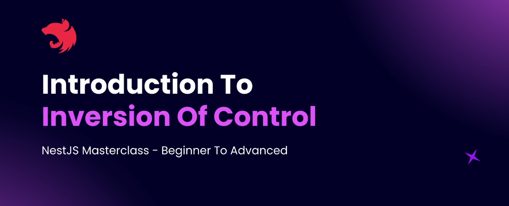

- **Dependency Injection:** A design pattern used to manage dependencies by providing them to classes rather than letting the classes instantiate them directly.

- **Inversion of Control (IoC):** Shifts the responsibility of creating and managing dependencies from the class to an external framework or tool (e.g., NestJS).

### What is a Dependency?

**Example:** A User class required by both Post and Page classes to associate posts/pages with a user.
Dependency occurs when one class relies on another class to function.

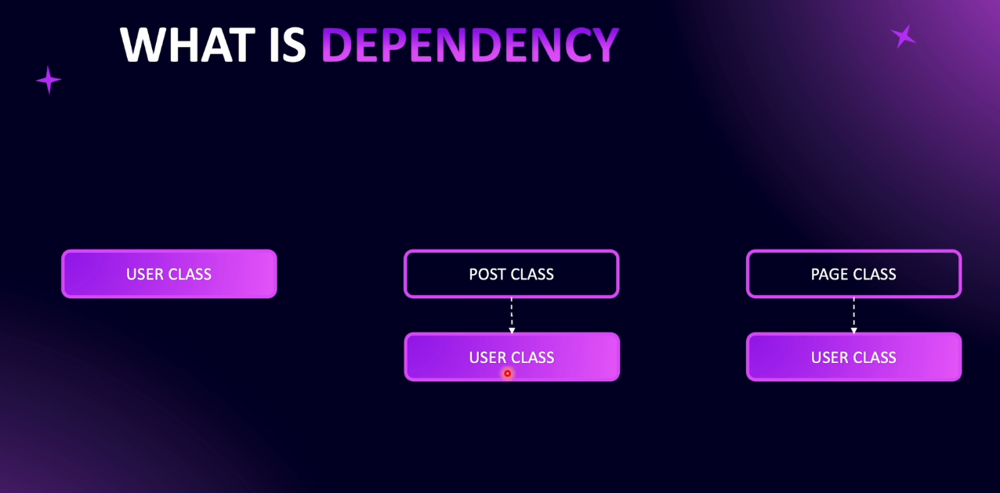

### Benefits of Dependency Injection

1. **Single Instance:**

   - Dependencies, such as a User instance, are created once and reused across different parts of the application. This promotes efficient memory usage and ensures consistency.

2. **Loose Coupling:**

   - Classes depend on abstractions (interfaces) rather than concrete implementations. This makes it easier to change the implementation of a dependency without affecting the classes that use it.

3. **Simplified Testing:**

   - Dependencies can be replaced with mock objects during testing. This allows for isolated tests and ensures that the behavior of a class can be tested without involving external dependencies.

4. **Efficient Resource Usage:**
   - By reusing existing instances of dependencies, the application conserves resources and reduces overhead associated with creating new objects.

### Code Example

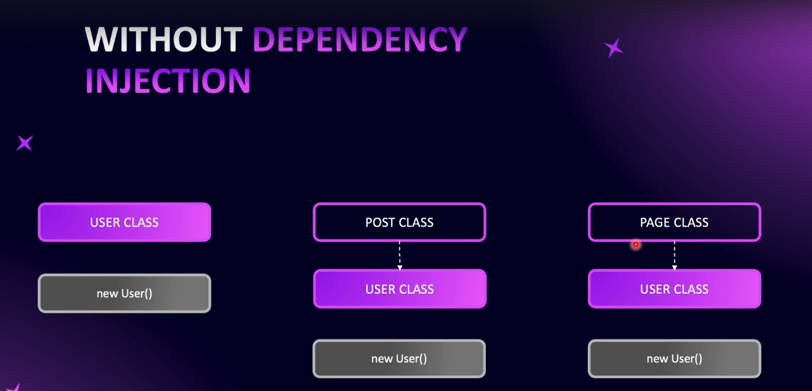

without DI

```typescript
class User {
  constructor() {
    console.log("User was instantiated")
  }
}

class Post {
  private user = new User() // Creates a new instance
  constructor() {
    console.log("Post class was instantiated")
  }
}

class Page {
  private user = new User() // Creates another new instance
  constructor() {
    console.log("Page class was instantiated")
  }
}

const post = new Post()
const page = new Page()
```

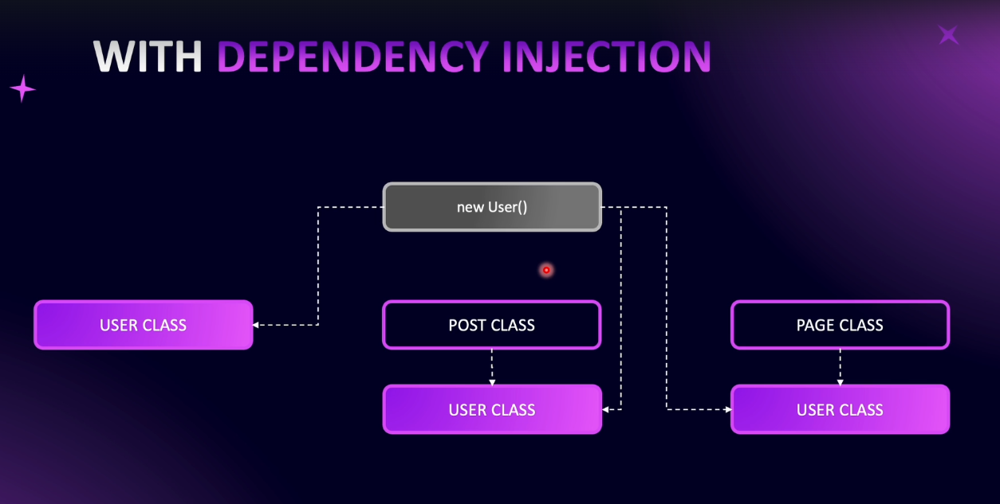

with DI

```typescript
class User {
  constructor() {
    console.log("User was instantiated")
  }
}

class Post {
  constructor(private user: User) {
    console.log("Post class was instantiated")
  }
}

class Page {
  constructor(private user: User) {
    console.log("Page class was instantiated")
  }
}

const user = new User() // Single instance created
const post = new Post(user) // Dependency injected
const page = new Page(user) // Dependency injected
```

Dependency injection in NestJS not only simplifies dependency management but also ensures better maintainability, testability, and scalability of applications.

---

## 2. Dependency Injection in NestJS

# Dependency Injection in NestJS


### Understanding Dependency Injection (DI)

Dependency Injection (DI) is the backbone of a NestJS application, making it modular and scalable. It follows the principle of **Inversion of Control (IoC)**, allowing NestJS to manage dependencies and their lifecycle.

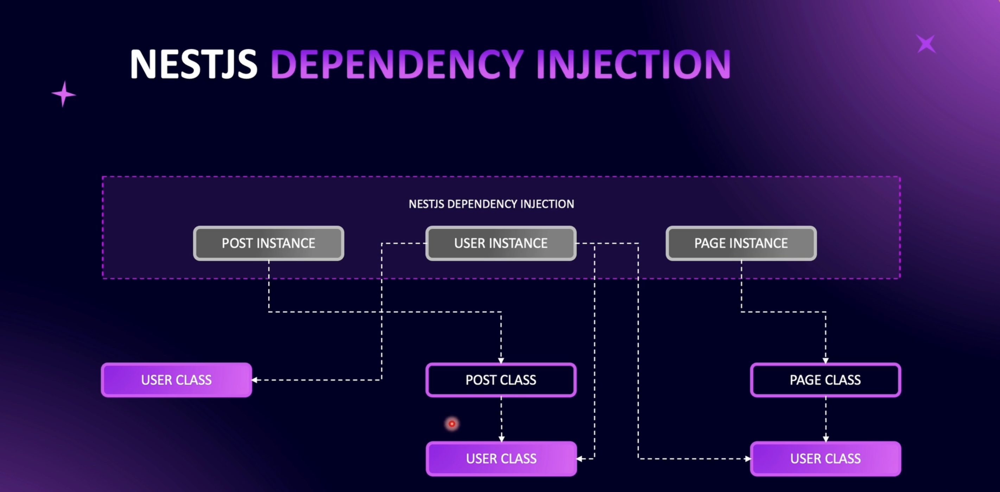

### How NestJS Handles Dependency Injection

- NestJS creates a **dependency graph**, determining the order of instantiation.
- Dependencies are instantiated only once (Singleton pattern) and injected where required.
- NestJS ensures that dependent classes (e.g., `Post` and `Page`) do not create multiple instances of `User`, optimizing memory usage.

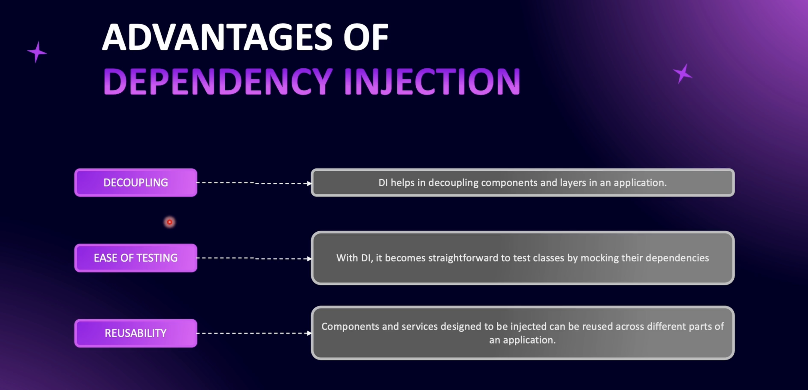

### Advantages of Dependency Injection

1. **Decoupling of Components**

   - Dependencies are injected rather than instantiated inside the class.
   - Promotes modularity and flexibility in the application.

2. **Easier Testing**

   - Allows mocking dependencies for unit tests.
   - Enables testing individual modules without requiring real dependencies.

3. **Reusability**
   - A single instance of a dependency is shared across multiple modules.
   - Reduces redundant instantiations and improves performance.

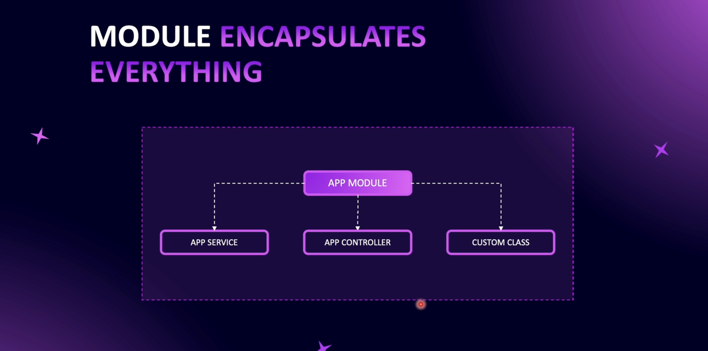

### How Modules Manage Dependency Injection

- **Modules encapsulate services and providers**
- **Providers** can be **provided** within the module for internal use.
- **Exports** allow sharing providers with other modules.

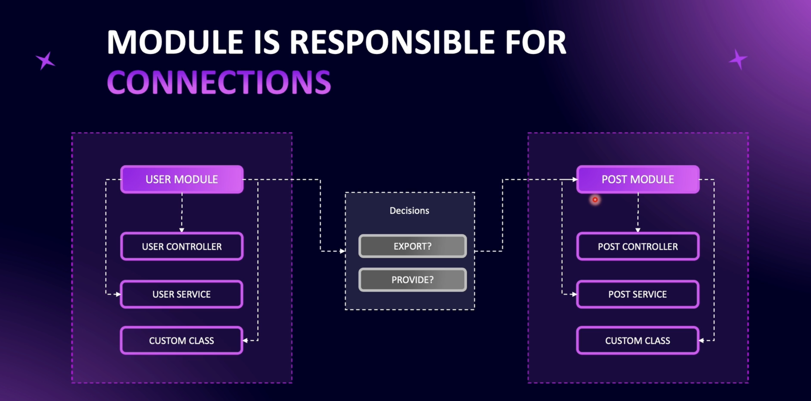

### Example: User Module & Post Module

```typescript
@Module({
  providers: [UserService],
  exports: [UserService] // Allows PostModule to use UserService
})
export class UserModule {}

@Module({
  imports: [UserModule],
  providers: [PostService]
})
export class PostModule {}
```

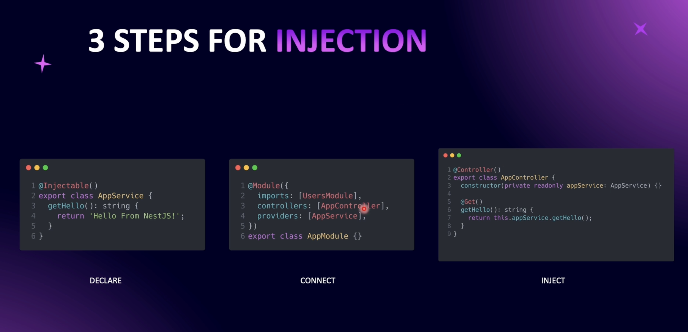

### Steps to Implement Dependency Injection

1. **Declare an Injectable Provider**

   ```typescript
   @Injectable()
   export class AppService {
     getHello(): string {
       return "Hello World!"
     }
   }
   ```

2. **Register Provider in a Module**

   ```typescript
   @Module({
     providers: [AppService]
   })
   export class AppModule {}
   ```

3. **Inject Provider into a Controller**

   ```typescript
   @Controller()
   export class AppController {
     constructor(private readonly appService: AppService) {}

     @Get()
     getHello(): string {
       return this.appService.getHello()
     }
   }
   ```

### Conclusion

- DI in NestJS simplifies module dependencies and improves code maintainability.
- Understanding **Providers, Modules, and Injection** is key to mastering DI.
- As you practice, the concepts will become second nature.

---

## 3. Create a Users Service

### Overview

This guide covers the implementation of Dependency Injection within a module in NestJS. We create a `UsersService` provider and integrate it into the `UsersModule`, making it available for use in the `UsersController`.

### Steps to Implement Dependency Injection

### 1. Create the `UsersService`

- Navigate to the `users` directory.
- Create a new directory named `providers`.
- Inside `providers`, create a file called `users.service.ts`.
- Add the `@Injectable()` decorator to make it a provider.

#### `users.service.ts`

```typescript
import { Injectable } from "@nestjs/common"

@Injectable()
export class UsersService {
  constructor() {}

  // Define business logic methods here
}
```

### 2. Connect `UsersService` to `UsersModule`

- Import `UsersService` into `users.module.ts`.
- Add `UsersService` to the `providers` array.

#### `users.module.ts`

```typescript
import { Module } from "@nestjs/common"
import { UsersService } from "./providers/users.service"
import { UsersController } from "./users.controller"

@Module({
  providers: [UsersService],
  controllers: [UsersController]
})
export class UsersModule {}
```

### 3. Inject `UsersService` into `UsersController`

- Import `UsersService` into `users.controller.ts`.
- Inject it using the constructor.

#### `users.controller.ts`

```typescript
import { Controller } from "@nestjs/common"
import { UsersService } from "./providers/users.service"

@Controller("users")
export class UsersController {
  constructor(private readonly usersService: UsersService) {}

  // Define routes that utilize usersService methods here
}
```

### Summary

- **Step 1**: Created `UsersService` with `@Injectable()`.
- **Step 2**: Registered `UsersService` in `UsersModule`.
- **Step 3**: Injected `UsersService` into `UsersController`.
- Now, `UsersService` is available in `UsersController` for handling business logic while keeping the controller focused on routing.

[service injection](https://github.com/NadirBakhsh/nestjs-resources-code/commit/129e001f1ac8e57a13a3a95a4c9b77c9b8d7fb14)

---

## 4. findAll Users Method


### Overview

In NestJS, controllers should only handle routing logic, while business logic should reside inside services (also known as providers). This separation improves maintainability, scalability, and code organization.

### Moving Business Logic to a Service

- The `UsersController` should **only** receive requests, validate them using DTOs, and delegate processing to the `UsersService`.
- The `UsersService` should handle business logic such as fetching data from the database.

### Implementing `findAll` in `UsersService`

- The `findAll` method retrieves users from the database.
- It takes query parameters (`limit`, `page`) and a DTO (`GetUsersParamDto`).
- Initially, it returns mock user data until database integration is implemented.

### Example Implementation:

```typescript
@Injectable()
export class UsersService {
  findAll(params: GetUsersParamDto, limit: number, page: number) {
    return [
      { firstName: "John", email: "john@example.com" },
      { firstName: "Alice", email: "alice@example.com" }
    ]
  }
}
```

### Injecting UsersService into UsersController

- The controller injects the UsersService using dependency injection.
- The findAll method is called inside the controller, passing required parameters.

Example Controller:

```typescript
@Controller("users")
export class UsersController {
  constructor(private readonly usersService: UsersService) {}

  @Get()
  getUsers(
    @Query() params: GetUsersParamDto,
    @Query("limit") limit: number,
    @Query("page") page: number
  ) {
    return this.usersService.findAll(params, limit, page)
  }
}
```

### Benefits of This Approach

- Cleaner Controllers – Only handle request validation and delegation.
- Reusable Services – Business logic can be reused in multiple parts of the application.
- Easier Testing – Services can be tested independently without HTTP concerns.
- Improved Scalability – Adding new logic becomes easier without modifying controllers.

[findall Users Method](https://github.com/NadirBakhsh/nestjs-resources-code/commit/805515670efde9c8dbb08d18dab3b167608bdebe)

---

## 5. findOneById Users Method

#### Implement findOneById in UsersService

Since you're not using a database yet, we'll use a simple array of users.

```typescript
import { Injectable } from "@nestjs/common"

@Injectable()
export class UsersService {
  public findOneById(id: number) {
    return { id: 1, name: "John Doe", email: "john@example.com" }
  }
}
```

### Use the New Method in UsersController

Now, expose this method via an API endpoint.

```typescript
import { Controller, Get, Param } from "@nestjs/common"
import { UsersService } from "./users.service"

@Controller("users")
export class UsersController {
  constructor(private readonly usersService: UsersService) {}

  @Get(":id")
  findOne(@Param("id") id: string) {
    return this.usersService.findOneById(Number(id))
  }
}
```

## 6. Practice: Create a Posts Module

- Posts Controller
- Posts Service
- Inject Posts Service inside Posts Controller as a dependency

## 7. Solution: Create a Posts Module

- code is available in [github](https://github.com/NadirBakhsh/nestjs-resources-code/commit/18cf95fce21ec8429599a248f558ec50bfc654d0)

## 8. Types of Dependencies

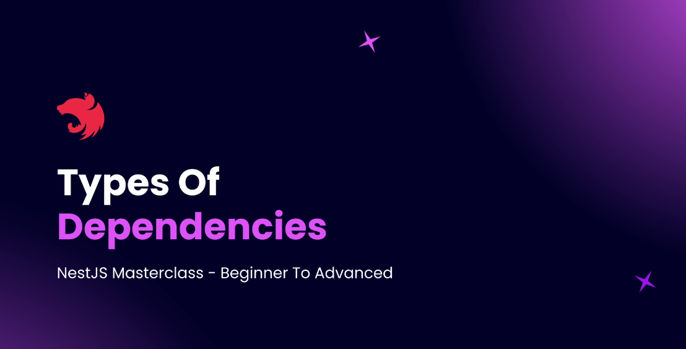

### Dependency Injection in NestJS

This document covers various types of dependency injections in NestJS, focusing on intra-module and inter-module dependencies, with a brief look at circular dependencies.

---

### Intra-Module Dependency

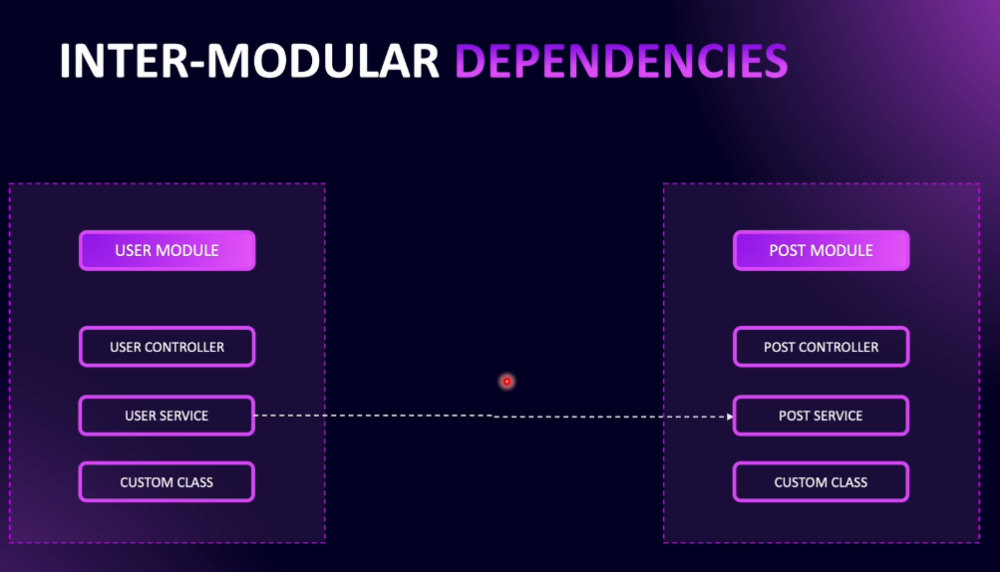

- **Definition:**  
  Dependency injection within the same module.

- **Example:**  
  A user controller depending on a user service within the users module.

- **Key Points:**
  - Simplifies component interaction as all components reside in the same module.
  - Handled automatically by NestJS through providers declared in the module.

### Inter-Module Dependency


- **Definition:**  
  Dependency injection where a component (service or controller) in one module depends on a service provided by another module.

- **Example Scenario:**

  - The **post service** in the posts module depends on the **user service** in the users module.
  - This dependency is necessary because the posts module requires user information (such as determining which user a post belongs to) and that functionality is encapsulated within the users module.

- **Key Points:**
  - **Separation of Concerns:**  
    Each module handles its domain-specific functionality. The users module manages user data, while the posts module focuses on posts.
  - **Scalability:**  
    Inter-module dependencies enable modularity, making it easier to maintain and scale the application.
  - **Implementation:**  
    NestJS allows importing one module into another to resolve these dependencies.

### Circular Dependency (Preview)

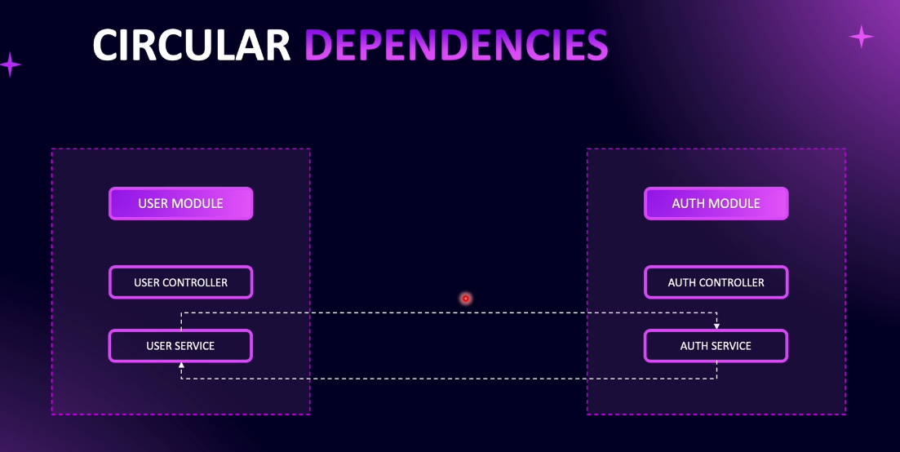

- **Definition:**  
  A situation where two modules depend on each other.

- **Example Scenario:**

  - An **auth service** in the authentication module depends on the user service.
  - Simultaneously, the **user service** depends on the authentication service.

- **Key Points:**
  - Circular dependencies can introduce complexities and require special handling in NestJS.
  - Detailed strategies for managing circular dependencies will be covered in subsequent discussions.

### Summary

- **Intra-Module Dependency:**  
  Simple and straightforward dependency management within a single module.

- **Inter-Module Dependency:**  
  Enables clean separation of responsibilities by allowing modules to depend on services provided by other modules.

- **Circular Dependency:**  
  A special case of inter-module dependency that necessitates careful design to avoid pitfalls.

---

## 9. Create a GET Posts Route with DTO


### Inter-Module Dependency Injection in NestJS

### Overview

This guide covers **Inter-Module Dependency Injection** in NestJS, demonstrating how the **Users Module** and **Posts Module** can interact using Dependency Injection (DI).

### Creating a GET Endpoint for Posts

1. **Define the Route**: Create a GET endpoint to fetch posts by `userId`.
2. **Use NestJS Decorators**:
   - `@Get(':userId')` – Defines the GET route.
   - `@Param('userId')` – Extracts the user ID from the request.
3. **Implement the Controller Method**:

   ```ts
   @Get(':userId')
   getPosts(@Param('userId') userId: string) {
       return this.postService.findAll(userId);
   }

   ```

### 4. Define Service Method:

- The findAll method in PostService fetches posts for the given userId.
- The method is called inside the controller.

### 4. Creating the PostService Method

1. Define findAll Method in PostService

```typescript
findAll(userId: string) {
    console.log(`Fetching posts for User ID: ${userId}`);
}
```

1. Inject PostService into PostController to use this method.

- code is available in [github](https://github.com/NadirBakhsh/nestjs-resources-code/commit/3e4ea45bf9afea453953337d0bdce42b459af030)

---

## 10. Return Posts From Posts Service

Dependency Injection (DI) is a design pattern used to manage dependencies between classes efficiently. In the context of a Post Controller, DI helps inject the required services without directly instantiating them.

code example [github](https://github.com/NadirBakhsh/nestjs-resources-code/commit/3e4ea45bf9afea453953337d0bdce42b459af030)

## 11. Use Users Service Inside Posts Service

code example [use-users-service-inside-posts-service](https://github.com/NadirBakhsh/nestjs-resources-code/commit/48e6be4f56f4fc8e9f506cafcd19d984ee0c896b)

## 12. Practice: Create an Auth Module

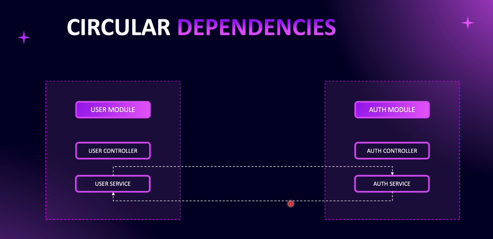

### Steps:

- Create an Auth Module.
- Add Auth Service and Auth Controller.
- Inject Auth Service into Auth Controller.
- Ensure Circular Dependency Handling.

## 13. Solution: Create an Auth Module

code example [github](https://github.com/NadirBakhsh/nestjs-resources-code/commit/09e08551a6d04b698eac12281d751ca9927f369b)

## 14. Circular Dependency

### Introduction
Circular dependencies occur when two or more modules depend on each other, leading to errors in NestJS. To resolve this, NestJS provides the `forwardRef()` function.

### Scenario
We are implementing an authentication system where:
- `AuthService` needs `UserService` to verify users.
- `UserService` needs `AuthService` to check authentication status.

### Steps to Handle Circular Dependency

### 1. **Inject `UserService` into `AuthService`**
- Import `UsersModule` into `AuthModule`.
- Inject `UserService` in `AuthService`.
- Use `forwardRef()` in `AuthModule`:

```typescript
import { forwardRef, Inject } from '@nestjs/common';
import { UsersService } from '../users/users.service';

@Injectable()
export class AuthService {
  constructor(
    @Inject(forwardRef(() => UsersService))
    private readonly usersService: UsersService,
  ) {}
}
```

### 2. **Inject `AuthService` into `UserService`**
- Export `AuthService` in `AuthModule`.
- Import `AuthModule` in `UsersModule` using `forwardRef()`.
- Inject `AuthService` into `UserService`:

```typescript
import { forwardRef, Inject } from '@nestjs/common';
import { AuthService } from '../auth/auth.service';

@Injectable()
export class UsersService {
  constructor(
    @Inject(forwardRef(() => AuthService))
    private readonly authService: AuthService,
  ) {}
}
```

### 3. **Modify Module Imports**
#### `auth.module.ts`
```typescript
import { forwardRef } from '@nestjs/common';
import { UsersModule } from '../users/users.module';

@Module({
  imports: [forwardRef(() => UsersModule)],
  providers: [AuthService],
  exports: [AuthService],
})
export class AuthModule {}
```

#### `users.module.ts`
```typescript
import { forwardRef } from '@nestjs/common';
import { AuthModule } from '../auth/auth.module';

@Module({
  imports: [forwardRef(() => AuthModule)],
  providers: [UsersService],
  exports: [UsersService],
})
export class UsersModule {}
```

### Execution
- Running the application should now work without circular dependency errors.
- The `AuthService` can use `UserService`, and `UserService` can use `AuthService`.

### Conclusion
Using `forwardRef()` resolves circular dependencies in NestJS by allowing lazy evaluation of module imports, ensuring that dependencies load properly. Always use `Inject()` and `forwardRef()` when modules depend on each other.

code example [github](https://github.com/NadirBakhsh/nestjs-resources-code/commit/f964a4d9022b20d9227087739ced3a065f88da3d)

