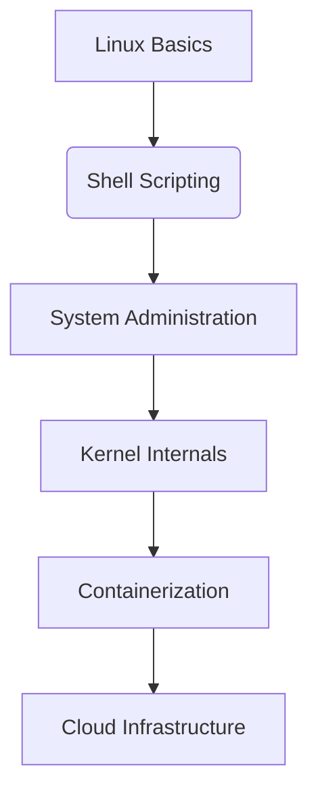

# 🐧 Linux Nerd Gateway

- [NixOS](./nixos/index.md)

## 🔍 Quick Reference
| Command | Description |
|---------|-------------|
| `tmux new -s dev` | Start new tmux session |
| `htop` | Interactive process viewer |
| `ncdu` | Disk usage analyzer |
| `strace -p $(pidof firefox)` | Trace system calls |
| `systemctl --user status` | Check user services |

---

## 🔧 Core Systems
### Package Management
- [[apt_cheatsheet]] (Debian/Ubuntu)
- [[dnf_tips]] (Fedora)
- [[pacman_power]] (Arch)
- [[nix_flakes]] (Declarative packages)

### Kernel & Hardware
- [[custom_kernel_build]]
- `lsmod` - List loaded modules
- `journalctl -k` - Kernel logs
- [[udev_rules]] (Device management)

---

## 🚀 Power User Tools
### Terminal Wizards
- [[vimrc_secrets]]
- [[bash_zsh_hacks]]
- [[fzf_everywhere]]
- [[ripgrep_vs_grep]]

### System Monitoring
- `btop` (Resource monitor)
- `iftop` (Network traffic)
- `glances` (All-in-one monitor)

---

## 🔒 Security & Debugging
### Hardening
- [[firejail_sandboxing]]
- `sudo sysctl -p` (Apply kernel tweaks)
- [[fail2ban_config]]

### Forensics
- `lsof -i :80` (Open ports)
- `auditd` logs
- `chkrootkit` scan

---

## 📚 Advanced Concepts
### Namespaces & Containers
- [[cgroups_deepdive]]
- `unshare --mount` (Create new namespace)
- [[docker_under_the_hood]]

### Filesystem Magic
- `debugfs` (Ext4 recovery)
- `btrfs scrub` (Data integrity)
- [[fuse_hacks]]

---

## 📖 Learning Paths

