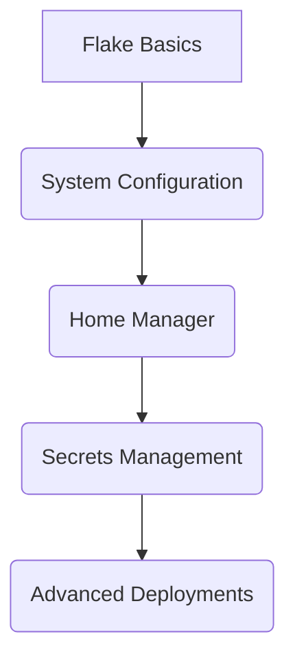

# 🐧 NixOS Knowledge Hub

## 🔍 Quick Start
```bash
# Rebuild system from flake
sudo nixos-rebuild switch --flake .#

# Activate home config
home-manager switch --flake .#
```

## 🧱 Core Concepts 

[nix-flakes](./nix-flakes) • [[nixos-modules]] • [[home-manager]] • [[secrets-management]] 

## Key Components

- Flake Integration : [[nix-flakes]] (dependency management)
- System Config : [[nixos-modules]] (hardware, services)
- User Env : [[home-manager]] (dotfiles, tools)
- Security : [[secrets-management]] (encrypted data)
     

## 🔧 Configuration Layers 

### System 
- [[hardware-configuration]] (auto-generated)
- [[network-setup]] (firewall, DNS)
- [[services]] (nginx, postgres)
     

### User 
- [[shell-config]] (zsh, starship)
- [[dev-tools]] (neovim, docker)
- [[gui-apps]] (firefox, discord)
     

## 🚀 Advanced Topics

[[nixos-containers]] • [[cross-machine-sync]] • [[custom-kernel]] • [[nixos-in-production]] 


## 📖 Learning Path




> [!WARNING]  
> - Forgetting to `git add` new files
> - Mixing imperative (nix-env) and declarative configs
> - Not checking nix flake check before deployment
     

## 📎 Resources 

- [NixOS Wiki](https://nixos.wiki/wiki/Overview_of_the_NixOS_Linux_distribution)
- [Home Manager Manual](https://nix-community.github.io/home-manager)
- [[../linux/index]] (General Linux knowledge)
